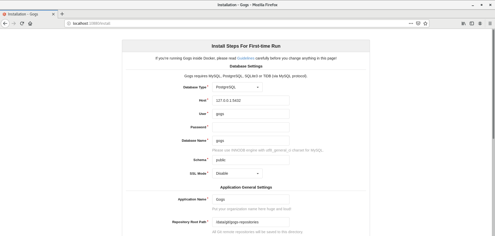
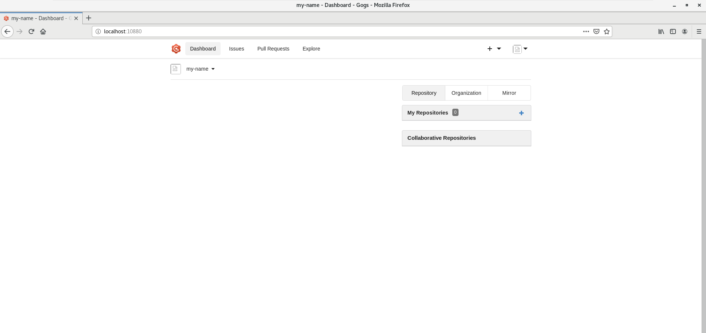
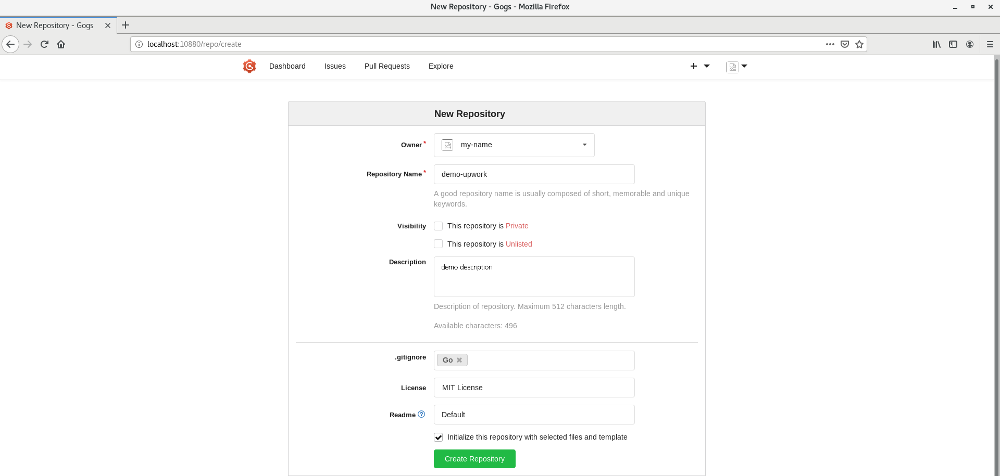
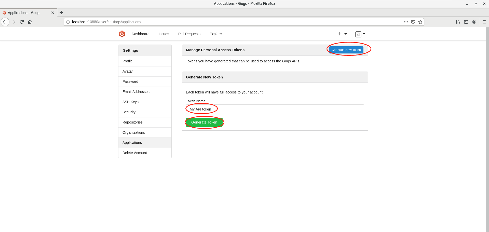

# kcg-devops-gogs-mirror

## Document steps

## 1. Run gogs.

- https://github.com/gogs/gogs
- https://gogs.io/docs/installation/install_from_source.html

### Go for Gogs

#### Install from source

https://gogs.io/docs/installation/install_from_source.html

##### Installing Go

Gogs requires Go 1.18 to compile, please refer to the [official documentation](https://go.dev/doc/install) for how to install Go in your system.

```shell
$ go version
go version go1.19.8 linux/amd64
```

##### Set Up the Environment

We are going to create a new uand set up everything under that user:

```shell
sudo adduser --disabled-login --gecos 'Gogs' git

# CentOS:
sudo useradd -r -m -d /home/git -s /sbin/nologin -c "Gogs" git
```

##### Compile Gogs

###### Build with Tags

A couple of things do not come with Gogs automatically, you need to compile Gogs with corresponding build tags.

Available build tags are:

- pam: PAM authentication support
- cert: Generate self-signed certificates support
- minwinsvc: Builtin windows service support (or you can use NSSM to create a service)

```shell
# Clone the repository to the "gogs" subdirectory
git clone --depth 1 https://github.com/gogs/gogs.git gogs
# Change working directory
cd gogs
# Compile the main program, dependencies will be downloaded at this step
go build -tags "cert" -o gogs
```

##### Custom configuration

```shell
$ mkdir -p custom/conf

$ vi custom/conf/app.ini
# Copy these contents(conf/app.ini) into app.ini, replacing git with your current system user
BRAND_NAME = Gogs
RUN_USER   = git
RUN_MODE   = prod

[database]
TYPE     = sqlite3
HOST     = 127.0.0.1:5432
NAME     = gogs
SCHEMA   = public
USER     = gogs
PASSWORD =
SSL_MODE = disable
PATH     = data/gogs/data/gogs.db

[repository]
ROOT           = data/git/gogs-repositories
DEFAULT_BRANCH = master

[server]
DOMAIN           = localhost
HTTP_PORT        = 10880
EXTERNAL_URL     = http://localhost:10880/
DISABLE_SSH      = false
SSH_PORT         = 10022
START_SSH_SERVER = false
OFFLINE_MODE     = false

[mailer]
ENABLED = false

[auth]
REQUIRE_EMAIL_CONFIRMATION  = false
DISABLE_REGISTRATION        = false
ENABLE_REGISTRATION_CAPTCHA = true
REQUIRE_SIGNIN_VIEW         = false

[user]
ENABLE_EMAIL_NOTIFICATION = false

[picture]
DISABLE_GRAVATAR        = false
ENABLE_FEDERATED_AVATAR = false

[session]
PROVIDER = file

[log]
MODE      = file
LEVEL     = Info
ROOT_PATH = data/gogs/log

[security]
INSTALL_LOCK = true
SECRET_KEY   = d4wTSI1d3NRGzt0
```

##### Test Installation

To make sure Gogs is working:

```shell
./gogs web
```

If you do not see any error messages, hit Ctrl-C to stop Gogs.

## 2. Gogs may be run locally on any system with golang, or could be run in a docker container.

- like git pull, git clone of gogs

### Docker for Gogs

To keep your data out of Docker container, we do a volume ($HOME/gogs -> /data) here, and you can change it based on your situation.

```shell
# Pull image from Docker Hub.
$ docker pull gogs/gogs

# Create local directory for volume.
$ mkdir -p $HOME/gogs

# Use `docker run` for the first time.
$ docker run -d --name=gogs -p 10022:22 -p 10880:3000 -v $HOME/gogs:/data -v $HOME/gogs/gogs/conf:/data/gogs/conf gogs/gogs

# Use `docker start` if you have stopped it.
$ docker start gogs
```

Note: It is important to map the SSH service from the container to the host and set the appropriate SSH Port and URI settings when setting up Gogs for the first time. To access and clone Git repositories with the above configuration you would use: `git clone ssh://git@hostname:10022/username/myrepo.git` for example.

In our example we have to type the following address into the browser:
`http://localhost:10880/install`

As a result you should see the setup page of Gogs:

<!--  -->

In this setup page we need to adapt the default settings to the settings we defined in the docker run command we executed previously. Thus, please change the input fields according to this table:

| Input field     | Description                                                      |
| --------------- | ---------------------------------------------------------------- |
| Database Type   | Replace PostgresSQL with SQLite3                                 |
| SSH Port        | Replace 22 with 10022                                            |
| HTTP Port       | Replace 3000 with 10880                                          |
| Application URL | Replace http://localhost:3000/ with http://localhost:10880/      |
| Log Path        | Replace /app/gogs/log with /data/gogs/log                        |
| Username        | Set an your username e.g. my-name                                |
| Password        | Set an your password with at least 8 characters e.g. my-Passw0rd |
| E-mail          | Set your email address e.g. demo@upwork.com                      |

After you filled all required fields, it should look like this:

<!--  -->

To finish the setup, click on **Install Gogs** at the bottom of the page.

After installing in you should see the start page of the Gogs service.

<!--  -->

Nice, you successfully installed Gogs! Now let’s start using it! Please continue with the next section to learn how.

### How to create a Git repository in Gogs

Before we will be able to git push, we need to

- create a Git repository in Gogs
- configure your public SSH key in Gogs
- clone the Git repository in Gogs to your local workstation

Let’s start by creating a new repository. Click on the **blue button** in the top right corner of the page and choose **New Repository**.

<!--  -->

You should see a setup page for your new repository. Please fill out the two text input fields.

At the bottom of the page you will find a checkbox. We recommend to enable this checkbox since it automatically will initialize this repository with a README.md. The following screenshot shows an example of how the setup page might look like after you provided all the necessary information.

<!--  -->

Finish the setup by clicking on **Create Repository**.

Before you can actually use the new repository, you need to add your SSH key. Click on The settings button in the top right corner of the page. Then, go to **SSH Keys -> Add Key**.

<!-- 
 -->

Paste your public SSH key into this `Content` field and set an arbitrary `Key Name`, e.g. ssh-rsa.

If you don’t know where to find your SSH key, execute the following command in your terminal.

```shell
cat ~/.ssh/id_rsa.pub
```

As you can see in the following screenshot, you should see your SSH key as result.

<!--  -->

Finally, back in the Gogs website, click the green button **Add Key** to add your public SSH key. Afterwards you should see a message confirming that the key has been added successfully.

<!-- 
 -->

At this point, Gogs should be set up properly to receive your first commit! As a last step, we will `git clone` the new repo to your workstation.

#### How to generate gogs access token on command line

### Start using Git with the new repository

Gogs helps us in constructing the proper `git clone` command. Navigate inside your new repository in the Gogs Web-GUI and click on **SSH**. Make sure that the SSH button in front of the command is activated and copy the string in the text field via the **Copy** button on the right edge.

<!--  -->

Now open a terminal at your workstation and navigate to the location where you want to create the folder for the repository.

Paste the command you just copied from Gogs Web-GUI. Before executing add git clone ssh:// in front of the command and put port 10022 in front of your user name. In our case 10022 is the port Gogs listens on for SSH.

In the end the command should look similar to this one:

```shell
git clone ssh://git@localhost:10022/my-name/demo-upwork.git
```

After this command has been executed confirm the fingerprint prompt and navigate into the new directory that has been created by this command.

Within the repository folder execute a `git pull`. If the command returns Already up-to-date the repository is properly set up.

<!--  -->

## - how to create token

### GUI - Create github token

https://github.blog/2013-05-16-personal-api-tokens/

### Script - Create gogs token

```shell
$ go run main.go create-access-token -b http://localhost:10880 -u administrator -p password -n script_token_202304
2023/04/25 09:09:31 creating access token with gogs...
2023/04/25 09:09:31 user administrator created access token, Name: script_token_202304, Sha1: 4d2da9c0bb5c15170c6ebfc1e076cd40eb6bd4fa
2023/04/25 09:09:31 Successfully created acccess token, total cost: 16.201227ms
```

### GUI - Create gogs token

To obtain an API token for Gogs, you need to follow these steps:

1. Log in to your Gogs account.

2. Click on your avatar in the upper right corner of the webpage and then click **Your Settings**.

3. In the settings page, select **Applications** from the sidebar.
   <!--  -->

4. In the "Manage Personal Access Tokens" section, and click on **Generate New Token**.

5. Provide a descriptive "Token Name" for the token (for example, "My API token") and click **Generate Token**.
   <!--  -->

6. Gogs will generate a new API token for you. Be sure to copy the token to a safe place, as you won't be able to see it again. If you lose the token, you'll need to generate a new one.

You can now use this API token to authenticate your requests to the Gogs API. Remember to include the token in the "Authorization" header of your HTTP requests, like this:

## - how to run script

### list-org

```shell
# Usage
$ go run main.go list-org -h
Get a list of github organizations

Usage:
  gogs-helper list-org [flags]

Flags:
  -t, --github-token string   GitHub access token
  -h, --help                  help for list-org

# Example
$ go run main.go list-org -t YOUR_GITHUB_TOKEN
```

### list-org-repo

```shell
# Usage
$ go run main.go list-org-repo -h
Get a list of github repositories in an organization

Usage:
  gogs-helper list-org-repo [flags]

Flags:
  -t, --github-token string   GitHub access token
  -h, --help                  help for list-org-repo
  -o, --org-name string       grabs all repos from an organization

# Example
$ go run main.go list-org-repo -t YOUR_GITHUB_TOKEN -o demo-33383080
```

### clone

```shell
# Usage
$ go run main.go clone -h
Clone all repos from GitHub organization into a local directory. Duplicate clone will fail: exit status 128

Usage:
  gogs-helper clone [flags]

Flags:
  -t, --github-token string   GitHub access token
  -h, --help                  help for clone
  -o, --org-name string       grabs all repos from an organization
  -d, --workdir string        The working directory will store all the repository of github

# Example
$ go run main.go clone -t YOUR_GITHUB_TOKEN -o demo-33383080 -d repos
2023/04/24 16:03:41 Cloning GitHub repositories to local directory...
2023/04/24 16:03:44 Cloning repository demo-33383080/go-demo, cost: 2.764543569s
2023/04/24 16:03:47 Cloning repository demo-33383080/python-demo, cost: 2.820298126s
2023/04/24 16:03:50 Cloning repository demo-33383080/rust-demo, cost: 3.145889356s
2023/04/24 16:03:50 Successfully cloned repositories, total cost: 9.616009742s
```

### create-access-token

```shell
# Usage
$ go run main.go create-access-token -h
Create an access token with a user and password

Usage:
  gogs-helper create-access-token [flags]

Flags:
  -b, --gogs-base-url string   Gogs base URL, e.g. http://localhost:10880
  -h, --help                   help for create-access-token
  -p, --pass string            System user password, e.g. password
  -n, --token-name string      Access token name, e.g. script_token
  -u, --user string            System user, e.g. admin

# Example
$ go run main.go create-access-token -b http://localhost:10880 -u administrator -p password -n script_token_202304
2023/04/25 09:09:31 creating access token with gogs...
2023/04/25 09:09:31 user administrator created access token, Name: script_token_202304, Sha1: 4d2da9c0bb5c15170c6ebfc1e076cd40eb6bd4fa
2023/04/25 09:09:31 Successfully created acccess token, total cost: 16.201227ms
```

### create-public-key

```shell
# Usage
$ go run main.go create-public-key -h
Create a public key to use git ssh

Usage:
  gogs-helper create-public-key [flags]

Flags:
  -b, --gogs-base-url string   Gogs base URL, e.g. http://localhost:10880
  -t, --gogs-token string      Gogs access token, e.g. 5bfee6a4f169870796561210eb94679381d4503d
  -h, --help                   help for create-public-key
  -k, --key string             SSH public key, e.g. cat ~/.ssh/id_rsa.pub
  -s, --title string           SSH title, e.g. ssh-rsa

# Example
$ go run main.go create-public-key -b http://localhost:10880 -t 5bfee6a4f169870796561210eb94679381d4503d -s ssh-rsa -k "ssh-rsa AAAAB3NzaC1yc2EAAAADAQABAAACAQDWeNnzfxYtdm0sBG2+AxrXYM0tVFhhwr2Wxosuc2GaA8kMV6TwgR+yTbP86QLy/RkbgYheCoVdKs41EtsGHSvT5SW9FbmXDKHq6tIluPnaEAmLlJh3PeBtAef5obqgp0mkTjTeAr4DYfwGrPdpmqMwoMqezRAoa5vTI7AOFoxHgJX2LyvGi3M5KwGBTi/Mym1zPHtXjRkqYyYktVukJnteJ2Sh/oaXMgQIPrgFSrg8WjkVaOOXtNacaWZZ42ePCBnleCVVNf09hfuceIBadOrmvPjpuomAfSyUzgnZZ/Dv5ulZoKUe5UOx9e5n6Gylii+o510PfFZueLa3APHB2AD3dPHfb30d71wO0uz+lxN7zhUOJEn9IVV2agc75UAsJOmd7vc0U4pnzjt9Hase4vmFoV63i6f9EuqZaJBzPeHjnTLu+gvsvoNyaIywJlFZxF5kIMeIA8SNf8QMQbZif4gql/Ssb564IGPNJoaBgwLBsDyCwlPgpDmJ/u5KBJ5Hq6K4KB78IdwuXNxwxmxWqG8t5JIkMfeG36o8NvjtwJM6pQuONxT+PMVkvBov9w7eOV2PCcbT/28k64OmZMmWRCNYnaBZ7RvYApjiFpdVyFKC3ROWgXjhVpacrSMdPmVzLKRubnKct7OnJ+kfP9mg/fx9czQV+cu7TDAAq/vgmC/HJQ== wff19940326@gmail.com"
2023/04/24 16:48:33 creating public key with gogs...
2023/04/24 16:48:33 created public key, Title: ssh-rsa, URL: http://localhost:10880/api/v1/user/keys/1
2023/04/24 16:48:33 Successfully created public key, total cost: 31.746193ms
```

### add

```shell
# Usage
$ go run main.go add -h
Add all repositories from a local directory to Gogs

Usage:
  gogs-helper add [flags]

Flags:
  -b, --gogs-base-url string   Gogs base URL, e.g. http://localhost:10880
  -s, --gogs-ssh-url string    Gogs ssh URL, e.g. ssh://git@localhost:10022
  -t, --gogs-token string      Gogs access token, e.g. 221a1527091612fade38d265742b84c40ab17de1
  -h, --help                   help for add
  -o, --org-name string        Add all repos to an organization
  -d, --workdir string         The working directory will store all the repository of github

# Example
$ go run main.go add -b http://localhost:10880 -t 4d2da9c0bb5c15170c6ebfc1e076cd40eb6bd4fa -o demo-33383080 -d repos -s ssh://git@localhost:10022
2023/04/25 09:14:11 Adding repositories to gogs...
2023/04/25 09:14:12 Adding repository repos/go-demo.git to gogs, cost: 362.264121ms
2023/04/25 09:14:12 Adding repository repos/python-demo.git to gogs, cost: 328.826171ms
2023/04/25 09:14:12 Adding repository repos/rust-demo.git to gogs, cost: 315.496392ms
2023/04/25 09:14:12 Successfully added repositories, total cost: 1.014036102s
```

### update

```shell
# Usage
$ go run main.go update -h
Update all existing repos in Gogs

Usage:
  gogs-helper update [flags]

Flags:
  -h, --help             help for update
  -d, --workdir string   The working directory will store all the repository of github

# Example
$ go run main.go update -d repos
2023/04/25 09:23:53 Updating Gogs repositories from Github...
The authenticity of host 'github.com (140.82.114.4)' can't be established.
ECDSA key fingerprint is SHA256:p2QAMXNIC1TJYWeIOttrVc98/R1BUFWu3/LiyKgUfQM.
ECDSA key fingerprint is MD5:7b:99:81:1e:4c:91:a5:0d:5a:2e:2e:80:13:3f:24:ca.
Are you sure you want to continue connecting (yes/no)? yes
2023/04/25 09:23:58 Updating repository repos/go-demo.git, cost: 5.093054417s
2023/04/25 09:24:01 Updating repository repos/python-demo.git, cost: 3.021705811s
2023/04/25 09:24:04 Updating repository repos/rust-demo.git, cost: 2.88737189s
2023/04/25 09:24:04 Successfully updated, total cost: 11.002365063s
```

### help

```shell
$ go run main.go --help
A helper tool to clone and update repositories between GitHub and Gogs

Usage:
  gogs-helper [command]

Available Commands:
  add                 Add all repositories from a local directory to Gogs
  clone               Clone all repos from GitHub organization into a local directory
  completion          Generate the autocompletion script for the specified shell
  create-access-token Create an access token with a user and password
  create-public-key   Create a public key to use git ssh
  help                Help about any command
  list-org            Get a list of github organizations
  list-org-repo       Get a list of github repositories in an organization
  update              Update all existing repos in Gogs

Flags:
  -h, --help   help for gogs-helper

Use "gogs-helper [command] --help" for more information about a command.
```
